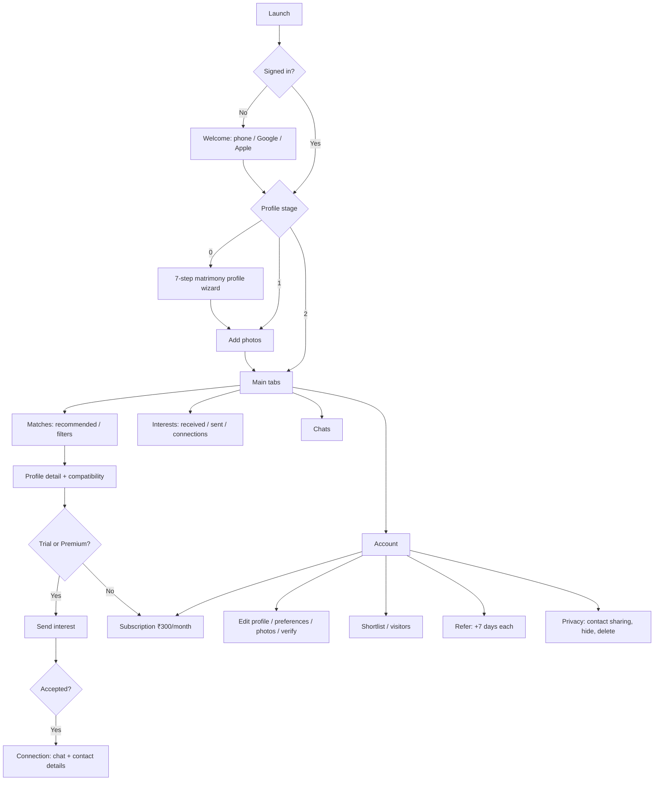

# NRI Shaadi 💍

> **Matrimony for Indians around the world.** NRI Shaadi helps Non-Resident Indians (and families in India looking for NRI alliances) find a life partner. It offers detailed matrimony profiles, preference-based matching, interests, and private chat.

**Pricing:** every new member gets **1 month free**. After that, sending interests and messaging needs **Premium at ₹300/month**. The price is the same for brides and grooms.

---

## Table of Contents

1. [Features](#features)
2. [Membership & Pricing](#membership--pricing)
3. [Tech Stack](#tech-stack)
4. [App Flow](#app-flow)
5. [Project Structure](#project-structure)
6. [Quick Start](#quick-start)
7. [Environment Variables](#environment-variables)
8. [Firebase, Google Sign-In & Play Setup](#firebase-google-sign-in--play-setup-new-app-comnrishaadiapp)
9. [API Reference](#api-reference)
10. [Database](#database)
11. [Push Notifications](#push-notifications)
12. [Admin Panel](#admin-panel)
13. [Branding](#branding)
14. [Deployment](#deployment)

---

## Features

### Matrimony profile (7-step onboarding wizard)
| Step | Details captured |
|------|------------------|
| **Basics** | Profile created by (self / parent / sibling / relative / friend), name, gender, date of birth, height, marital status, children |
| **Religion & horoscope** | Religion, community / caste, sub-community, gotra, "caste no bar", mother tongue, manglik, rashi, birth time & place |
| **NRI details** | Country & city of residence, citizenship, residency / visa status (citizen, PR / Green Card, work visa, student visa…), where they grew up, native state & city in India, willingness to relocate |
| **Education & career** | Highest qualification, field, college, occupation, employer, sector, annual income bracket |
| **Family** | Family type, values, status, father's and mother's occupation, brothers, sisters, family location, about family |
| **Lifestyle & about** | Diet, smoking, drinking, hobbies, "About me" (min. 30 characters) |
| **Partner preferences** | Age and height range, marital status, religions, communities, mother tongues, countries, education, diet, manglik, and what they're looking for |

The wizard saves a draft locally, so users can leave and continue later. The same wizard is used for **Edit profile**.

### Finding a partner
- **Matches tab.** Sort by *Recommended* (partner-preference score), *Newest*, or *Recently active*.
- **Filters:** age, height, religion, mother tongue, country of residence, marital status, education, diet, residency status, community, keyword, *verified only*, *with photo only*. Filters are saved on the device.
- **Match cards:** photo carousel, **match %** against your preferences, verified and premium badges, NRI location line (e.g. "Software Engineer · Toronto, Canada · PR"), and actions to skip (with undo), shortlist, or send interest.
- **Full profile:** all sections, a **compatibility panel** ("You match X of their preferences"), profile ID (`NS…`), report / block, and a safety tips note.

### Interests & connections
- **Send interest** with an optional personal note. The other member can **accept** or **decline**, and the sender can **withdraw**.
- **Interests tab:** *Received*, *Sent* (with status), and *Connections* (accepted).
- **Contact details** (phone / email) are shown only to **connections who have Premium**. Members can turn contact sharing off in *Privacy & account*.
- **Shortlist** profiles to review later, and see **who viewed your profile**.

### Chat
- Real-time chat over Socket.IO, with unread badges on the Chats tab.
- A daily cap applies to starting **new** conversations. Replies in existing chats are not capped.

### Account & safety
- Photo upload (up to 6) and **selfie photo verification** (AWS Rekognition).
- Profile completeness meter.
- Hide profile for 1–3 months ("found my match / taking a break").
- Delete account.
- Report profiles and photos; block members.
- Refer friends and family: both people get **7 extra free days**.
- Admin panel: reports, bans, user search, and marketing push notifications filtered by city / country / gender / religion.

---

## Membership & Pricing

| State | Browse / search / shortlist / visitors | Send & accept interests | Chat | See contact details of connections |
|-------|:---:|:---:|:---:|:---:|
| **Free trial** (first 30 days) | ✅ | ✅ | ✅ | ✅ |
| **Trial ended** (free) | ✅ | ❌ | ❌ | ❌ |
| **Premium – ₹300/month** | ✅ | ✅ | ✅ | ✅ |

- The trial starts at sign-up (`users.trialEndsAt`). Existing users receive a fresh 30-day trial when the matrimony migration runs.
- Premium is a single **Google Play auto-renewing subscription**. It is priced in INR, and Play shows the local-currency equivalent to NRIs abroad.
- Fair-use daily limits for trial and Premium: **50 interests** and **30 new conversations** per day.
- Local QA: set `DISABLE_PAID_FEATURES=true` (or run with `NODE_ENV=development`) to bypass all paid checks.

---

## Tech Stack

| Layer | Backend | Frontend |
|-------|---------|----------|
| Framework | NestJS 10 (TypeScript) | React Native 0.79 (TypeScript) |
| Data | PostgreSQL + TypeORM migrations | Zustand + MMKV |
| Auth | Firebase phone auth, Google / Apple, JWT | `@react-native-firebase/auth`, Google Sign-In |
| Payments | Google Play Developer API (subscription verification) | `react-native-iap` |
| Media | AWS S3, AWS Rekognition | `react-native-image-picker`, FastImage |
| Realtime / push | Socket.IO, Firebase Admin (FCM) | socket.io-client, `@react-native-firebase/messaging` |
| Navigation | — | React Navigation v6 (native stack + bottom tabs) |

---

## App Flow



---

## Project Structure

```
backend/src/
  auth/            Firebase phone + social auth, JWT, bans
  users/           Matrimony profile (profile-options.ts = allowed values), photos,
                   verification, partner preferences, visitors, referral, hide/delete
  discover/        Search & recommended matches (parameterised SQL, match score)
  likes/           Interests: send / accept / decline / withdraw, connections, full profile
  shortlist/       Shortlist toggle + list
  messages/        Inbox, conversations, Socket.IO gateway
  subscriptions/   Plan config, trial / premium access, Google Play verification
  common/          Premium guard, mail, legal pages (privacy policy)
  admin/  blocks/  reports/  devices/  tasks/  migrations/
  scripts/         seed-test-users.js (realistic NRI profiles)

frontend/src/
  constants/profileOptions.ts   All option lists (religions, countries, visa status…)
  components/
    brand/          BrandLogo (NRI Shaadi rings + wordmark)
    common/         Form controls (chips, pickers, steppers)
    discover/       MatchCard, FiltersModal
    profile/        ProfileRow, PartnerPreferencesForm
    subscription/   MembershipBanner (trial countdown / upgrade)
  navigation/       Stack + bottom tabs (Matches, Interests, Chats, Account)
  screens/
    auth/           Welcome, phone entry, OTP
    onboarding/     Stage1Screen (wizard / edit profile), Stage2Photos
    discover/       DiscoverScreen (Matches tab)
    profile/        ProfileDetail, Interests, ProfileList (shortlist / visitors), PartnerPreferences
    messages/       Inbox (Chats tab), ChatConversation
    account/        MyAccountScreen (Account tab)
    subscription/   SubscriptionScreen (₹300/month)
    settings/       AccountSettings (privacy & account)
    verification/  admin/
  store/            auth, badges (tab counts), locale, featureFlags
  utils/            subscription (trial/premium helpers), profileFormat
```

---

## Quick Start

### Backend
```bash
cd backend
cp .env.example .env         # fill DB_* and JWT_SECRET at minimum
npm install
npm run migration:run        # includes the NRI Shaadi matrimony migration
npm run start:dev            # http://localhost:3000/api/v1, Swagger at /api/docs
```

Seed realistic NRI test profiles (US, UK, Canada, UAE, Australia…):
```bash
node scripts/seed-test-users.js 40
```

Tests & typecheck:
```bash
npx tsc --noEmit
npx jest
```

### Frontend
```bash
cd frontend
npm install --legacy-peer-deps
npx react-native start
npx react-native run-android
```
The API base URL is set in `src/config/api.config.ts`.

---

## Environment Variables

| Variable | Required | Description |
|----------|----------|-------------|
| `DB_HOST`, `DB_PORT`, `DB_USERNAME`, `DB_PASSWORD`, `DB_NAME` | Yes | PostgreSQL |
| `JWT_SECRET` | Yes | JWT signing secret |
| `FIREBASE_PROJECT_ID`, `FIREBASE_CLIENT_EMAIL`, `FIREBASE_PRIVATE_KEY` | Prod | Phone auth + push |
| `AWS_ACCESS_KEY_ID`, `AWS_SECRET_ACCESS_KEY`, `AWS_REGION`, `AWS_S3_BUCKET` | Prod | Photos + verification |
| `GOOGLE_PLAY_PACKAGE_NAME`, Play service-account credentials | Prod | Subscription verification |
| `GMAIL_USER`, `GMAIL_APP_PASSWORD` | Prod | Admin alert emails |
| `PRIVACY_URL`, `TERMS_URL`, `SUPPORT_URL` | Prod | Legal links |
| `DISABLE_PAID_FEATURES` | No | `true` = bypass trial / premium checks (QA) |

---

## Firebase, Google Sign-In & Play Setup (new app: `com.nriconnectshaadi.app`)

NRI Shaadi is a separate app from SugarBF. It has its own package id, Firebase project and Play listing. Sign-in is by phone OTP, Google or Apple; Facebook login has been removed.

**1. Upload keystore** (one time; back it up, because you need it for every update):
```bash
cd frontend/android
keytool -genkeypair -v -storetype PKCS12 -keystore app/nrishaadi-upload.keystore -alias nrishaadi-upload -keyalg RSA -keysize 2048 -validity 10000
cp keystore.properties.example keystore.properties   # fill in passwords
keytool -list -v -keystore app/nrishaadi-upload.keystore -alias nrishaadi-upload   # note SHA-1 + SHA-256
```

**2. Firebase project**
1. In [Firebase Console](https://console.firebase.google.com), create a new project (e.g. `nri-shaadi`).
2. Add an **Android app** with package **`com.nriconnectshaadi.app`** and add the upload keystore's **SHA-1 and SHA-256**. Also add the debug keystore's SHA-1 (`keytool -list -v -keystore app/debug.keystore -storepass android`) so phone OTP and Google Sign-In work in debug builds.
3. **Authentication → Sign-in method:** enable **Phone** and **Google**.
4. Download **`google-services.json`** to `frontend/android/app/google-services.json` (it is gitignored).
5. In `google-services.json`, find `oauth_client`. Copy the `client_type: 3` id into `frontend/src/config/google.config.ts` (`GOOGLE_WEB_CLIENT_ID`) and into `GOOGLE_CLIENT_ID` in `backend/.env`. Copy the `client_type: 1` id into `GOOGLE_ANDROID_CLIENT_ID`.
6. **Project settings → Service accounts → Generate new private key.** Paste it as one line into `FIREBASE_SERVICE_ACCOUNT_JSON` in `backend/.env`, and set `FIREBASE_PROJECT_ID`.
7. **Cloud Messaging:** push notifications work automatically through the same project.

**3. Play Console**
1. Create a new app called **NRI Shaadi**. Upload the first AAB with package `com.nriconnectshaadi.app` (the package is permanent after this).
2. **Setup → App signing:** copy the **App signing key SHA-1 and SHA-256** into the Firebase Android app. Without this, Google Sign-In and phone OTP fail for users who install from Play.
3. **Monetize → Subscriptions:** create **`nrishaadi_premium_1m`**, a base plan that auto-renews monthly at **₹300**. Don't add a Play free trial, because the app gives every new member 30 days free.
4. **Setup → API access:** link a Google Cloud service account with the Android Publisher API. Grant it *View financial data / Manage orders and subscriptions*, then paste its JSON into `GOOGLE_PLAY_SERVICE_ACCOUNT_JSON`.

The backend verifies purchases at `POST /subscriptions/google-play/verify-subscription` and sets `subscriptionExpiresAt`.

---

## API Reference

Interactive docs: `/api/docs`. All routes are prefixed with `/api/v1`.

| Area | Method & path | Purpose |
|------|---------------|---------|
| Auth | `POST /auth/phone/check`, `POST /auth/phone/verify` | Firebase phone login → JWT |
| | `POST /auth/social` | Google / Apple |
| | `GET /auth/me` | Current user |
| Profile | `PATCH /users/profile/stage1` | Create / update matrimony profile |
| | `PATCH /users/profile/preferences` | Partner preferences |
| | `PATCH /users/profile/contact-privacy` | Share contact with connections on/off |
| | `GET/POST/DELETE /users/profile/photos…` | Photos |
| | `POST /users/verify/selfie` | Photo verification |
| | `GET /users/profile-visitors` | Who viewed me |
| | `GET /users/referral-code` | Referral code |
| | `PATCH /users/profile/hide` · `/unhide` · `DELETE /users/account` | Privacy |
| Matches | `GET /discover/matches` | Search / recommended (filters, sort, pagination) |
| | `POST` / `DELETE /discover/pass/:userId` | Skip / undo |
| Interests | `POST /likes/:userId` | Send / withdraw interest (optional message) |
| | `POST /likes/:userId/decline` | Decline received interest |
| | `GET /likes/you-liked` · `/liked-by` · `/matches` | Sent · received · connections |
| | `GET /likes/liked-by/unseen-count` · `POST /likes/liked-by/mark-seen` | Badge |
| | `GET /likes/profile/:userId` | Full profile + match score + contact (if allowed) |
| Shortlist | `GET /shortlist` · `POST /shortlist/:userId` | Shortlist |
| Chat | `GET /messages/inbox` · `/unread-count` · `/:userId` · `POST /messages/:userId` | Messaging |
| Membership | `GET /subscriptions/my-plans` · `/current` · `/feature-flags` | Plan + trial / premium status |
| | `POST /subscriptions/google-play/verify-subscription` | Verify Play purchase |
| Safety | `POST /reports/:userId` · `POST /blocks/:userId` | Report / block |
| Admin | `/admin/*` | Dashboard, reports, users, bans, push, audits |

---

## Database

The migration `1717600000000-NriShaadiMatrimony` adds these columns to `users`:
- All matrimony fields: religion / community, horoscope, NRI residency, career, family, lifestyle.
- `partnerPreferences` (JSON), `showContactToConnections`, `trialEndsAt`.
- New tables: `shortlists` and profile views.

The old dating columns (role, allowance, turn-ons) stay in the table so the migration is non-destructive, but the app no longer reads or writes them. Existing users get a new 30-day trial and are sent back through the matrimony onboarding.

Allowed values for every option field are defined once in `backend/src/users/profile-options.ts` and mirrored in `frontend/src/constants/profileOptions.ts`.

---

## Push Notifications

| Event | Title | Opens |
|-------|-------|-------|
| Interest received | 💌 New Interest | Interests → Received |
| Interest accepted | 🎉 Interest Accepted! / You are now connected! | Interests → Connections |
| New message | 💬 *Sender name* | Chat |
| Admin warning / ban / photo removed | ⚠️ / 🚫 / 📸 | In-app alert |

---

## Admin Panel

Available to users with `isAdmin = true` (Account → Admin panel). To make the first admin:
```sql
UPDATE users SET "isAdmin" = true, "isSuperAdmin" = true WHERE email = 'you@example.com';
```
Admins handle reports, bans (user / phone / email / IP), user search, password reset links, and marketing push (filters: city, country, gender, religion). Super admins can also promote or remove admins.

---

## Branding

- **Name:** NRI Shaadi. **Tagline:** "Matrimony for Indians around the world".
- **Palette:** maroon `#A4133C` and gold `#D4A017` on a deep-maroon background `#12090B`.
- **App icon:** `frontend/nrishaadi_app_icon.svg`, rendered to all Android `mipmap-*` densities (including round and adaptive icons).
- **Play Store assets:** `play-store-assets/icon-512.png` and `feature-graphic.png`; the feature-graphic source is `feature-graphic.svg`.

- **Android package:** `com.nriconnectshaadi.app`; it has its own Firebase project and Play listing (see setup above).
- **Domain:** the API and legal URLs still use `sugarbf.club` for now. To change them, update `frontend/src/config/api.config.ts`, the URLs in `backend/.env`, `deploy/nginx-api.conf` and the privacy policy page.

---

## Deployment

The backend and PostgreSQL run together on **one EC2 server** with Docker Compose (no RDS/Aurora). Full guide: [`backend/deploy/README.md`](backend/deploy/README.md).

```bash
# on the server
cd ~/NRI-Shaadi/backend
cp .env.production.example .env && nano .env   # DB_PASSWORD, JWT_SECRET, Firebase, Play, AWS
docker compose up -d --build                   # starts Postgres + API; migrations run automatically
bash scripts/db-backup.sh                      # schedule daily via cron

# Android release
cd frontend/android && ./gradlew bundleRelease # AAB for Play Console
```

---

*Private & proprietary. NRI Shaadi.*
